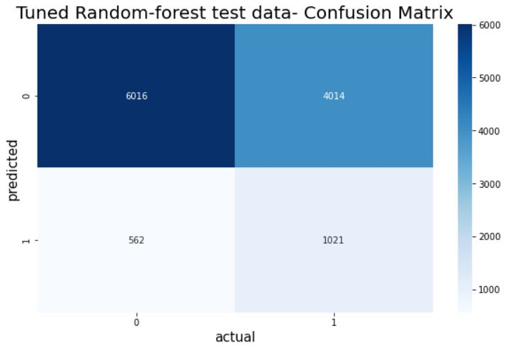
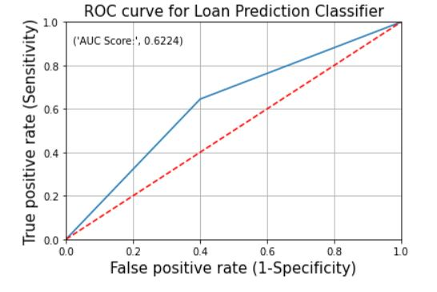
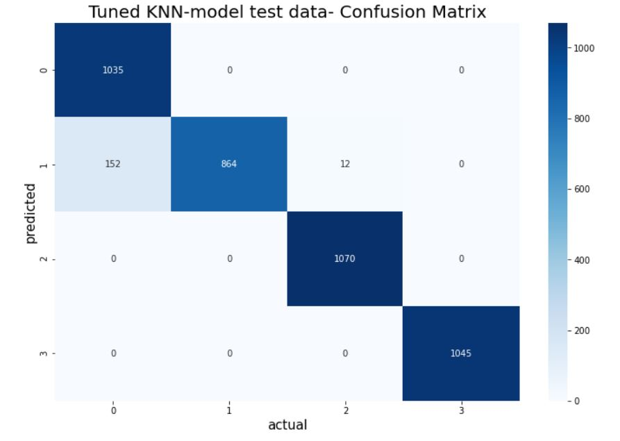

### Overview of all my major data science projects. Click on the project title to redirect to the project's github repository

# [Project 1- Capstone Project- Lending club classification](https://github.com/Chirag-Naik666/Lendingclub_loanprediction)
Binary classification for loan payment status on Lending club dataset from the year 2007-2011.
### About the project-
   This is my post graduation project (Finance Domain). It involves data cleaning, null value imputation, data visualization and fitting various models to get the best result.
### Python packages used- Imblearn, Pandas, Numpy, scipy, scikit-learn, seaborn and matplotlib.
### Final results-

   
# [Project 2- Hypothyroidism Classification](https://github.com/Chirag-Naik666/hypothyroidism)
Medical sector classification project. 
### About the project-
   In this project I am using various classification algorithms like Logistic regression,K-neighbours,Random forest etc to predict the patient's thyroid condition using the features in the dataset.
### Python Packages used- Pandas,Imblearn, NumPy, Scipy, Scikit-Learn, Seaborn and Matplotlib.
### Final results-

# [Project 3- EDA-Cricket](https://github.com/Chirag-Naik666/Cricket_EDA)
### Analysing and Visualizing Data collect from 'https://www.espncricinfo.com/ci/engine/series/1243364.html?view=records'
### About the project-
   As a Hardcore cricket fan and a Data enthusiast, I absolutely loved every second i spent on this project. The project involves collection of data from the cricinfo to make a csv file using MySQL and then analyse and visualize it using python3 jupyter notebook. Then further used Tableau public to get better visualization.
### Softwares Used- MySQL, python(pandas, NumPy, Matplotlib, Seaborn), Tableau public.
### Conclusion- A lot of match related analysis and visualization is done on the data to understand the test series in depth.

 
 
# [Project 4-Customer churn Classification](https://github.com/Chirag-Naik666/classification)
Telco Customer Churn Prediction using various classification algorithms.
### About the project-
   In this project I am using various classification algorithms like Naive Bayes, SVM, Linear Discriminant Analysis to predict the customer churn using the features in the dataset.
### Python Packages used- Pandas, NumPy, Scipy, Scikit-Learn, Seaborn and Matplotlib.

# [Project 5- Life Expectancy MLR](https://github.com/Chirag-Naik666/MLR)
### Multiple linear regression model predicting the life expectancy using the life expectancy dataset.
### About the project-
   In this project I am using multiple linear regression to predict the life expectancy using the features in the dataset. 
### Python Packages used- Pandas, NumPy, Scipy, Scikit-Learn, Statmodels, Seaborn and Matplotlib.
### Conclusion- The model predicts the life expectancy with the adjusted r-squared accuracy of 96.1%.
