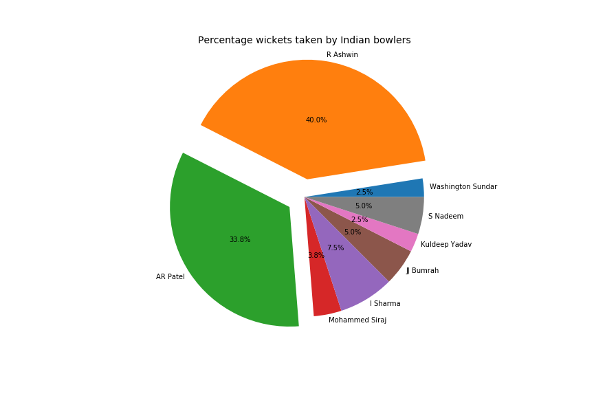
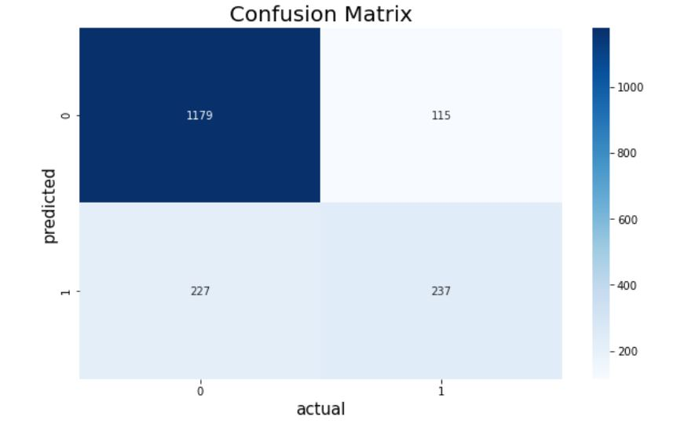

### Overview of all my data-science projects. Click on the project title to redirect to the project's github repository

# [Project 1- MLR](https://github.com/Chirag-Naik666/MLR)
### Multiple linear regression model predicting the life expectancy using the life expectancy dataset.
### About the project-
   In this project I am using multiple linear regression to predict the life expectancy using the features in the dataset. 
### Python Packages used- Pandas, NumPy, Scipy, Scikit-Learn, Statmodels, Seaborn and Matplotlib.
### Conclusion- The model predicts the life expectancy with the adjusted r-squared accuracy of 96.1%.

# [Project 2- EDA-Cricket](https://github.com/Chirag-Naik666/Cricket_EDA)
### Analysing and Visualizing Data collect from 'https://www.espncricinfo.com/ci/engine/series/1243364.html?view=records'
### About the project-
   As a Hardcore cricket fan and a Data enthusiast, I absolutely loved every second i spent on this project. The project involves collection of data from the cricinfo to make a csv file using MySQL and then analyse and visualize it using python3 jupyter notebook.
### softwares used- MySQL, python(pandas, NumPy, Matplotlib, Seaborn)
### Conclusion- A lot of match related analysis and visualization is done on the data to understand the test series in depth.

 
 
# [Project 3- Classification](https://github.com/Chirag-Naik666/classification)
Telco Customer Churn Prediction using various classification algorithms.
### About the project-
   In this project I am using various classification algorithms like Naive Bayes, SVM, Linear Discriminant Analysis to predict the customer churn using the features in the dataset.
### Python Packages used- Pandas, NumPy, Scipy, Scikit-Learn, Seaborn and Matplotlib.

